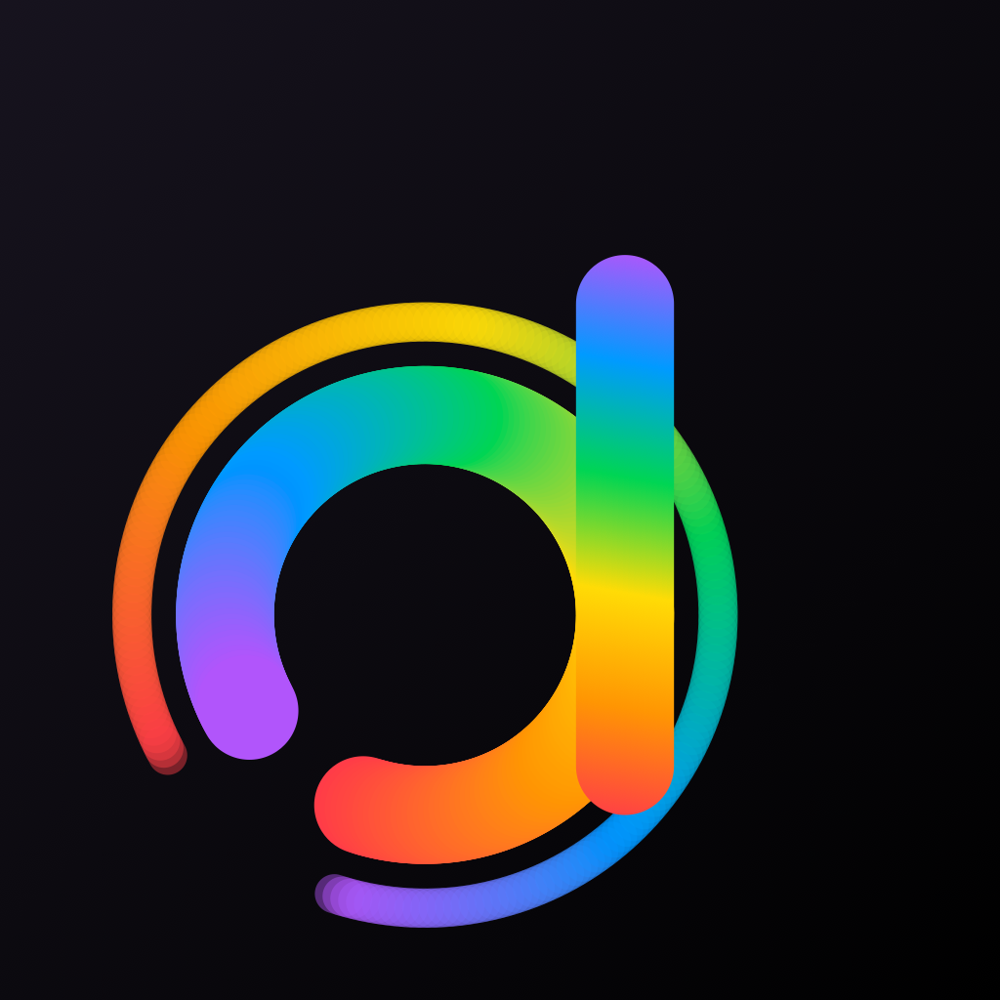

# Family Apps

A small AltStore / SideStore source for the apps made in this house.

**Source URL**

```
https://raw.githubusercontent.com/datcal/sideload/main/apps.json
```

[](altstore://source?url=https://raw.githubusercontent.com/datcal/sideload/main/apps.json)
[](sidestore://source?url=https://raw.githubusercontent.com/datcal/sideload/main/apps.json)

Open this page **on the iPhone** and tap a button — it opens AltStore or
SideStore with the source ready to add. On a computer the buttons do nothing;
copy the URL above instead and paste it into the app's **Sources → +**.

## The apps

| | | |
|---|---|---|
|  | **Simple Flash Card** | The official Goethe-Zertifikat A1 word list — 682 words and 848 example sentences, each with its Turkish and English. Eight kinds of question, German read aloud, works offline. |
|  | **Datcal** | Departure times for the Berlin lines you follow — at the stop, in a morning notification, on the Lock Screen and on the watch face. Works when the BVG service is down. Includes the flash cards. |

## Installing

These apps are **not signed**. You sign them yourself, on your own phone,
with your own free Apple ID — no payment, no developer programme, and no
credential ever reaches this repository.

1. Install **[SideStore](https://sidestore.io)** or **[AltStore](https://altstore.io)**.
   Either one needs a computer once, for the first setup.
2. Add the source with the button above.
3. Tap **FREE** next to an app.
4. **Settings → General → VPN & Device Management** → your Apple ID → **Trust**.
5. If the app will not open: **Settings → Privacy & Security → Developer Mode** → on.

A step-by-step guide in Turkish is in the app's own repository, at
`docs/sideload.md`.

## What a free Apple ID costs you

| | |
|---|---|
| **Signatures last 7 days** | The app stops opening; **Refresh All** in AltStore or SideStore brings it back. Nothing is lost, no data is deleted. |
| **Three apps at a time** | AltStore or SideStore itself is one of the three, so there is room for two of these. |
| **Ten App IDs a week** | Simple Flash Card uses one. Datcal uses four — the app, the Live Activity, the watch app and its complication. |

One thing does not work on a free Apple ID: Datcal's morning notification
cannot be marked Time Sensitive, so it stays silent while Sleep Focus is on.
Allow Datcal under **Settings → Focus → Sleep → Apps** and it comes through.
Simple Flash Card sends no notifications at all.

## What is in here

Only the listing, the icons and the built files — `apps.json`, `icons/`, and
the `.ipa` files under Releases. No source code.
